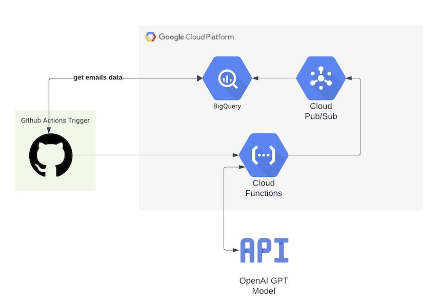
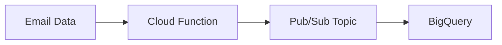

# *Sentiment Analysis Inference Engine*

This repo contains a template for a sentiment analysis inference engine. The terraform code will create a google cloud function that will be triggered by a pubsub topic. The function will read the message from the topic, perform sentiment analysis on the message, and write the result to a bigquery table.

Diagram of the architecture:


## Main Steps

1. Github Actions triggers the job and gets email data from BigQuery and sends it to the Cloud Function via http request. 
2. The Cloud Function then performs sentiment analysis on the email data and publishes the results to a Pub/Sub topic.
3. The Pub/Sub topic then writes the results to BigQuery.




## Getting Started

### Prerequisites

**Ensure that you have the following installed:**

- [ ] Python 3.10
- [ ] Poetry
- [ ] Terraform
- [ ] Google Cloud SDK


**Ensure that you have the following configured:**

- [ ] Google Cloud credentials
- [ ] OpenAI API key
- [ ] Google Cloud project
- [ ] Enable the following APIs:
  - [ ] Cloud Functions API
  - [ ] Cloud Build API
  - [ ] Cloud Pub/Sub API
  - [ ] Cloud Scheduler API
  - [ ] Cloud Source Repositories API
  - [ ] Cloud Storage API
  - [ ] Cloud Tasks API
  - [ ] Cloud Trace API
  - [ ] Compute Engine API
  - [ ] Container Registry API
  - [ ] Identity and Access Management (IAM) API
  - [ ] Service Management API
  - [ ] Service Usage API
  - [ ] Stackdriver Logging API
  - [ ] Stackdriver Monitoring API
  - [ ] Stackdriver Trace API

- [ ] [Configue Workload Identity Federation Pools in GCP](https://cloud.google.com/blog/products/identity-security/enabling-keyless-authentication-from-github-actions)
- [ ] Develop Github Actions workflow to trigger Cloud Function

## Exporting requirements.txt

```bash
poetry export --without-hashes --format=requirements.txt > requirements.txt
```

This project uses Terraform to manage Google Cloud resources, specifically Google Pub/Sub and BigQuery.

## Resources

The main resources created in this project are:

Google Pub/Sub Schema: This is an Avro schema for the messages that will be published to the Pub/Sub topic. The schema defines the structure of the messages.

Google Pub/Sub Topic: This is the topic to which messages will be published. The topic uses the schema defined above.

Google BigQuery Table: This is the table where the data from the Pub/Sub messages will be stored.

Google Cloud Function: This is the function that will post to the Pub/Sub topic. The function will read the message from the topic, perform sentiment analysis on the message, and write the result to the BigQuery table.

### Usage

To use this project, you need to have Terraform installed and configured with your Google Cloud credentials.

Clone the repository:

```bash
git clone https://github.com/jrtedeschi/ll_sentiment_analysis.git
```
Navigate to the project directory:

```bash
cd ll_sentiment_analysis
```

Initialize Terraform:

```bash
cd terraform && terraform init
```

Plan the Terraform changes:

```bash
terraform plan
```

Apply the Terraform changes:

```bash
terraform apply
```

Variables
The following variables are used in the main.tf file:

[] project_id: The ID of your Google Cloud project.
[] table_id: The ID of your BigQuery table.
[] dataset_id: The ID of your BigQuery dataset.

**Schema**
The Avro schema defined in the google_pubsub_schema resource and the BigQuery table schema have the following fields:

```python
{
    task_id: str
    account_id: str
    description: str
    subject: str
    openai_response: str
    openai_total_tokens: int
    openai_completion_tokens: int
    openai_prompt_tokens: int
    openai_model: str
    openai_system_fingerprint: str
    openai_created: str
    openai_object: str
    openai_id: str
}
```

Contributing
Please read CONTRIBUTING.md for details on our code of conduct, and the process for submitting pull requests to us.

License
This project is licensed under the MIT License - see the LICENSE.md file for details.
